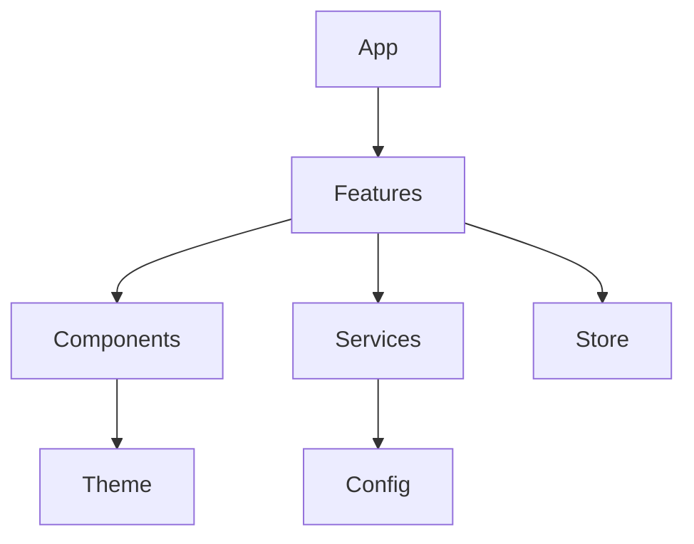

# BookAstors Folder Structure Guide

## Project Structure Overview

```
src/
├── app/                    # App initialization and configuration
├── assets/                 # Static assets
├── components/             # Shared components
├── config/                 # App configuration
├── features/              # Feature modules
├── hooks/                 # Custom hooks
├── navigation/            # Navigation setup
├── services/              # External services
├── store/                 # State management
├── theme/                 # UI theme configuration
├── types/                 # TypeScript types
└── utils/                 # Utility functions
```

## Detailed Structure

### 1. App Directory (`src/app/`)
```
app/
├── App.tsx                # Root component
├── bootstrap.ts           # App initialization
└── providers/            # Global providers
```

### 2. Assets Directory (`src/assets/`)
```
assets/
├── fonts/               # Custom fonts
├── images/             # Image assets
├── animations/         # Lottie files
└── icons/             # Custom icons
```

### 3. Components Directory (`src/components/`)
```
components/
├── common/             # Shared components
│   ├── Button/
│   ├── Input/
│   └── Card/
├── forms/             # Form components
├── layout/           # Layout components
└── modals/          # Modal components
```

### 4. Features Directory (`src/features/`)
```
features/
├── auth/             # Authentication feature
│   ├── components/
│   ├── hooks/
│   ├── services/
│   ├── store/
│   └── screens/
├── salon/           # Salon feature
├── booking/         # Booking feature
└── profile/         # Profile feature
```

### 5. Hooks Directory (`src/hooks/`)
```
hooks/
├── api/            # API related hooks
├── auth/           # Authentication hooks
├── common/         # Shared hooks
└── form/          # Form related hooks
```

### 6. Navigation Directory (`src/navigation/`)
```
navigation/
├── AppNavigator.tsx
├── AuthNavigator.tsx
├── TabNavigator.tsx
└── types.ts
```

### 7. Services Directory (`src/services/`)
```
services/
├── api/           # API services
├── firebase/      # Firebase services
├── storage/       # Local storage
└── analytics/    # Analytics services
```

### 8. Store Directory (`src/store/`)
```
store/
├── zustand/      # Zustand stores
│   ├── auth/
│   ├── booking/
│   └── salon/
└── redux/       # Redux stores
    ├── slices/
    ├── actions/
    └── store.ts
```

### 9. Theme Directory (`src/theme/`)
```
theme/
├── colors.ts
├── typography.ts
├── spacing.ts
└── index.ts
```

## Feature Module Structure

Each feature module follows this structure:
```
feature-name/
├── components/     # Feature-specific components
├── hooks/         # Feature-specific hooks
├── services/      # Feature-specific services
├── store/         # Feature-specific state
├── screens/       # Feature screens
├── types.ts       # Feature types
└── index.ts       # Feature exports
```

## Component Structure

Each component follows this structure:
```
ComponentName/
├── index.ts
├── ComponentName.tsx
├── ComponentName.styles.ts
├── ComponentName.types.ts
└── ComponentName.test.tsx
```

## Best Practices

### 1. File Naming
- Components: PascalCase (e.g., `Button.tsx`)
- Utilities: camelCase (e.g., `formatDate.ts`)
- Constants: UPPER_CASE (e.g., `API_ENDPOINTS.ts`)

### 2. Import Organization
```typescript
// External imports
import React from 'react';
import { View } from 'react-native';

// Internal imports
import { useAuth } from '@/hooks';
import { Button } from '@/components';

// Local imports
import { styles } from './styles';
```

### 3. Path Aliases
```typescript
// tsconfig.json
{
  "compilerOptions": {
    "baseUrl": "src",
    "paths": {
      "@/*": ["*"],
      "@components/*": ["components/*"],
      "@features/*": ["features/*"]
    }
  }
}
```

### 4. Module Boundaries
- Keep feature modules independent
- Use interfaces for cross-module communication
- Avoid circular dependencies

### 5. Code Organization
- Group related files together
- Keep components focused and single-responsibility
- Use index files for clean exports

## Module Dependencies



## Version Control

### .gitignore Structure
```
# Dependencies
node_modules/
yarn.lock

# Build
build/
dist/

# Environment
.env*

# IDE
.vscode/
.idea/

# OS
.DS_Store
```
